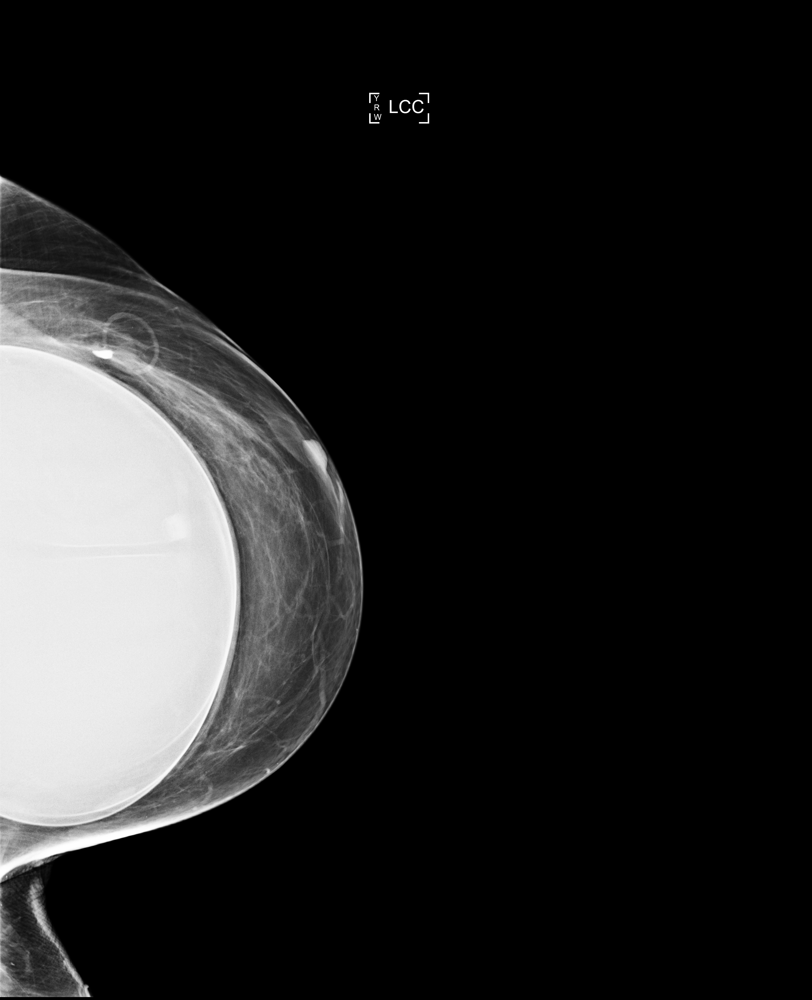
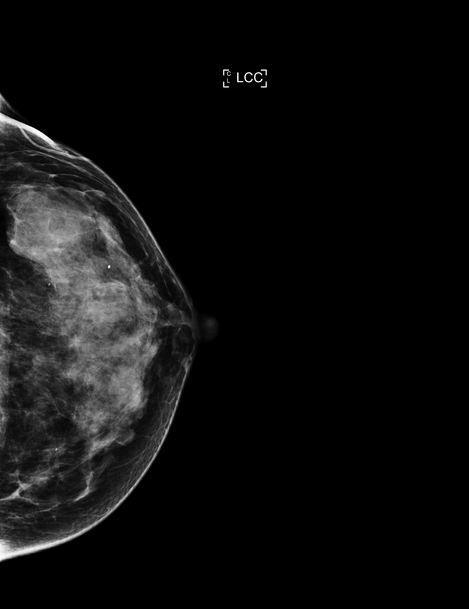

# ConvNeXt + CORAL Experiment

This folder contains the training and testing code for the ConvNeXt + CORAL experiment.

## Files
- `train_convnext.py`: Training script for ConvNeXt backbone with CORAL head.
- `test_convnext.py`: Evaluation script to test the best trained model.
- `results.txt`: Performance metrics and confusion matrix from the evaluation.

## Sample Mammography Images by Density
Below are sample images representing the four breast density categories (1: Fatty, 2: Scattered, 3: Heterogeneous, 4: Dense).

| Density 1 (Fatty) | Density 2 (Scattered) | Density 3 (Heterogeneous) | Density 4 (Dense) |
| :---: | :---: | :---: | :---: |
|  |  |  |  |

## Performance Results

--- Test Results ---
Test Accuracy: 0.7663
Test MAE: 0.2361
Test Quadratic Kappa: 0.8020

Classification Report:
               precision    recall  f1-score   support

        Fatty       0.59      0.75      0.66       388
    Scattered       0.77      0.75      0.76      1525
Heterogeneous       0.85      0.79      0.82      1623
        Dense       0.62      0.77      0.69       216

     accuracy                           0.77      3752
    macro avg       0.71      0.76      0.73      3752
 weighted avg       0.78      0.77      0.77      3752

Confusion Matrix:
[[ 292   94    2    0]
 [ 199 1140  181    5]
 [   2  249 1277   95]
 [   0    0   50  166]]
