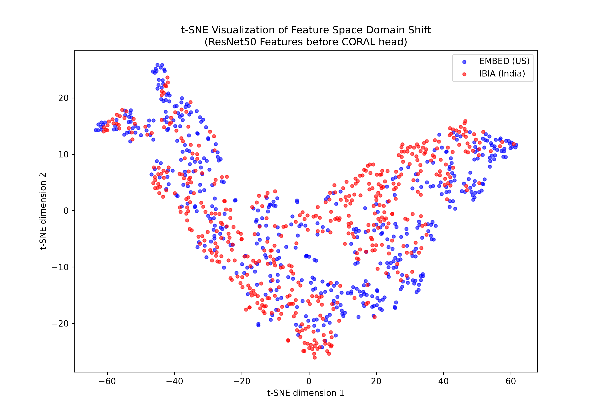
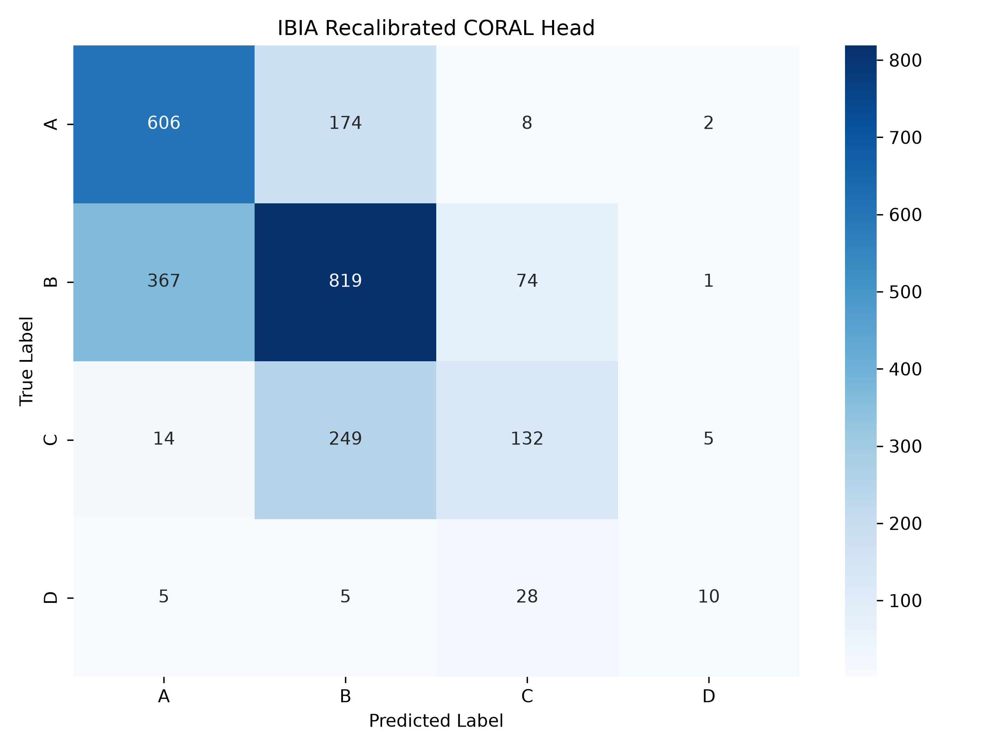

# Mammography Breast Density Classification: Experimental Consolidation

## 1. Project Overview & Motive
This project addresses the challenge of **Breast Density Classification** (BI-RADS Categories A, B, C, D) and specifically investigates the **Domain Shift** encountered when models trained on US populations (**EMBED**) are deployed on Indian populations (**IBIA**).

### Motive
Breast density is a critical risk factor for breast cancer and can mask tumors on mammograms. While high-performance models exist, generalization across different ethnic and anatomical populations is often poor. The objectives include:
1. Establishment of a robust baseline using traditional machine learning (LightGBM) and deep ordinal regression.
2. Quantification of the domain shift between the EMBED (Source) and IBIA (Target) datasets.
3. Development and evaluation of mitigation strategies including Zero-shot inference, Head recalibration, and Fine-tuning.

---

## 2. Dataset Description

| EMBED (Source - US) | IBIA (Target - India) |
| :---: | :---: |
|  |  |
| *Typical distribution: ~49% Dense studies* | *Overwhelmingly Non-Dense (~82% Non-Dense)* |

### EMBED (Source - US Population)
- **Scale:** 37,563 mammograms from 9,398 patients.
- **Stratification:** Patient-stratified split (80% Train, 10% Validation, 10% Test) to prevent data leakage.
- **Labels:** ACR BI-RADS 5th Edition breast density categories (A–D).
- **Modality:** Full-Field Digital Mammography (FFDM).
- **Cohort:** Diverse US population.
- **Key Characteristics:** 
    - ~49% of studies represent dense breasts (Categories C and D).
    - Subset curation ensured that 99.8% of patients possess complete 4-view mammograms (L/R CC and MLO).

### IBIA (Target - Indian Population)
- **Scale:** 3,569 images from 583 patients.
- **Labels:** ACR BI-RADS 5th Edition (A–D).
- **Modality:** Full-Field Digital Mammography (FFDM).
- **Cohort:** Indian clinical population.
- **Demographics:** Patient age range [23, 87], average age 50.0.
- **Key Characteristics:**
    - Significant anatomical distribution shift: ~82.1% are Non-Dense (A+B).
    - Average of ~6.1 images per patient.
    - Utilized for Zero-shot evaluation and small-split adaptation experiments.

---

## 3. Experimental Framework & Methodology

The experimental pipeline transitioned from traditional feature extraction to end-to-end deep ordinal learning.

### Phase 1: Feature Extraction Baseline (LightGBM)
A baseline was established using fixed feature extractors (ResNet50 and EfficientNet-B7 pretrained on ImageNet). 
- **Methodology:** High-dimensional feature vectors (2048-d for ResNet, 2560-d for EffNet) were extracted from the global average pooling layer.
- **Classifier:** These features served as input to a LightGBM gradient boosting machine, tuned for 4-class classification.
- **Inference:** While efficient, this approach treats density categories as independent classes, ignoring the inherent ordinal relationship (A < B < C < D).

### Phase 2: Deep Ordinal Regression (End-to-End)
To leverage the natural rank of BI-RADS categories, three deep ordinal regression architectures were implemented using a ResNet50 backbone. Unlike the baseline, the backbone was partially unfrozen to allow for domain-specific feature refinement.

1.  **OR-NN (Ordinal Neural Network):** Implemented using $K-1$ binary classifiers with independent weights. Each classifier predicts whether the density exceeds a specific threshold (e.g., Is Density > A? Is Density > B?).
2.  **CORAL (Consistent Rank Logits):** Utilizes shared weights across binary classifiers but learns unique, rank-consistent bias terms. This ensures that the probability of being in a higher category is consistently nested within lower categories.
3.  **CORN (Conditional Ordinal Regression):** Employs a conditional probability framework where the probability of reaching a certain rank is conditioned on having passed all previous ranks.

---

## 4. Key Results & Technical Inferences

### Inference 1: Systematic Over-prediction
Zero-shot evaluation on the IBIA dataset revealed a systematic over-prediction of density. Labels of "A" were frequently predicted as "B", and "B" as "C". This phenomenon is attributed to the learned prior distribution from the EMBED dataset, which contains a significantly higher proportion of dense tissue samples.

### Inference 2: Feature Space Domain Shift (t-SNE)
t-SNE projections of the ResNet50 feature space demonstrate that EMBED and IBIA samples form distinct, non-overlapping clusters.

  
   
  <i>t-SNE visualization: Feature shift across geographic cohorts.</i>

- **Technical Conclusion:** The domain shift is identified as a **fundamental feature shift** rather than a simple label bias. Anatomical features are encoded differently by the backbone for the two populations.

### Inference 3: Failure of Optical Mitigation (Histogram Equalization)
The application of histogram equalization to IBIA images resulted in a performance degradation (Kappa decrease from 0.48 to 0.33).
- **Technical Conclusion:** The domain shift is **semantic/anatomical**, not optical. Contrast enhancement amplified the specific features that trigger "high density" predictions in the EMBED-trained model, worsening the distribution mismatch.

### Inference 4: Efficacy of Head-Only Recalibration
Freezing the ResNet50 backbone and retraining only the ordinal head (biases and classification weights) on a 20% IBIA split yielded a significant performance boost (Kappa **+0.09**).
- **Technical Conclusion:** A substantial portion of the domain shift can be mitigated by adjusting the decision thresholds (bias terms) to align with the anatomical priors of the target population.

---

## 5. Performance on EMBED (Training Domain)

Comparison between traditional feature extraction (Baseline) and end-to-end ordinal regression architectures.

| Method | Accuracy | Quadratic Kappa | MAE |
| :--- | :---: | :---: | :---: |
| **ResNet50 + LGBM (Baseline)** | 0.6941 | ~0.72 | 0.35 |
| **CORAL** | 0.7335 | 0.7833 | 0.2700 |
| **CORN** | **0.7740** | 0.7884 | **0.2279** |
| **OR-NN** | 0.7508 | **0.8008** | 0.2508 |

---

## 6. Performance Matrix (Evaluation on IBIA)

| Strategy | Quadratic Kappa | Technical Result Summary |
| :--- | :--- | :--- |
| **Zero-shot (Baseline)** | 0.4844 | High bias due to learned EMBED priors. |
| **Histogram Equalization** | 0.3296 | Ineffective; amplified distribution shift. |
| **Head-Only Recalibration**| 0.5746 | Efficient adaptation via threshold shifting. |
| **Differential Fine-tuning** | **0.5971** | Optimal adaptation (Backbone 1e-5, Head 1e-3). |

---

## 7. Best Adapted Model Analysis: Recalibrated CORAL Confusion Matrix

The **CORAL** architecture is identified as the most effective framework for cross-population adaptation. While the Zero-Shot Kappa was 0.4844, the performance was significantly enhanced to **0.5746** through **Head-Only Recalibration**.

  
   
  <i>Confusion Matrix: Recalibrated CORAL Performance on the IBIA cohort.</i>

### Technical Interpretation:
1.  **Prior Alignment:** The recalibration of bias terms effectively aligned the model's decision thresholds with the Indian population's anatomical priors. This resulted in a substantial reduction in the systematic over-prediction observed during zero-shot inference.
2.  **Ordinal Integrity:** Strict ordinal consistency is maintained, with classification errors restricted almost exclusively to adjacent BI-RADS categories. The nested probability structure inherent to the CORAL architecture prevents logically inconsistent predictions.
3.  **Sensitivity vs. Specificity:** A marked improvement in the classification of Category A (Fatty) and Category B (Scattered) tissue is observed. By shifting the internal thresholds, the model became significantly more sensitive to the "Non-Dense" tissue patterns that dominate the IBIA cohort.
4.  **Adaptation Efficiency:** Significant performance gains were achieved by updating fewer than 1% of the total model parameters (classification head only). This confirms that the foundational features learned from the EMBED dataset remain robust, requiring only a recalibration of the decision boundaries for effective deployment.

---

## 8. Folder Structure
- `baseline_LGBM/`: Baseline experiments utilizing fixed feature extraction.
- `Ordinal_Regression/`:
    - `BEST_MODELS/`: Serialized weights for CORAL, CORN, and OR-NN.
    - `EXPERIMENTS/`: Comprehensive training logs and hyperparameter details.
    - `RESULTS/`: Performance metrics, confusion matrices, and t-SNE visualizations.
- `sample_images/`: Representative PNG samples from EMBED and IBIA cohorts.

---
**Technical Summary:** The transition from US-based (EMBED) to India-based (IBIA) clinical data involves significant anatomical and distribution shifts. While differential fine-tuning provides the performance ceiling, head-only recalibration is identified as a highly effective and computationally cheap strategy for cross-continental model deployment.

