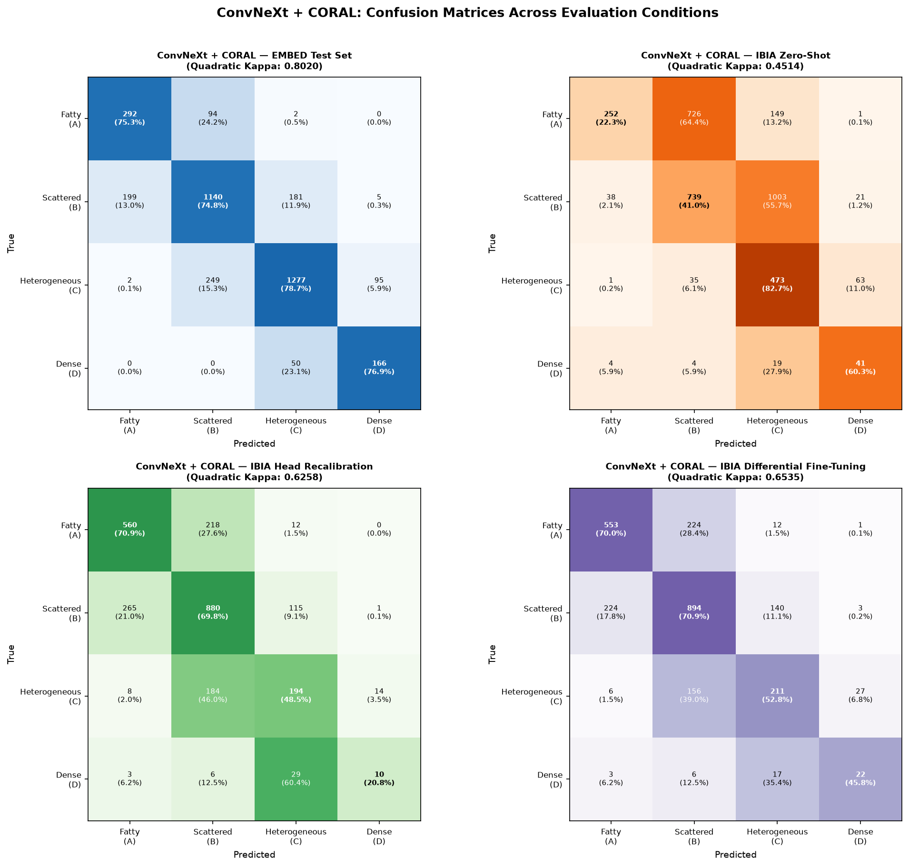
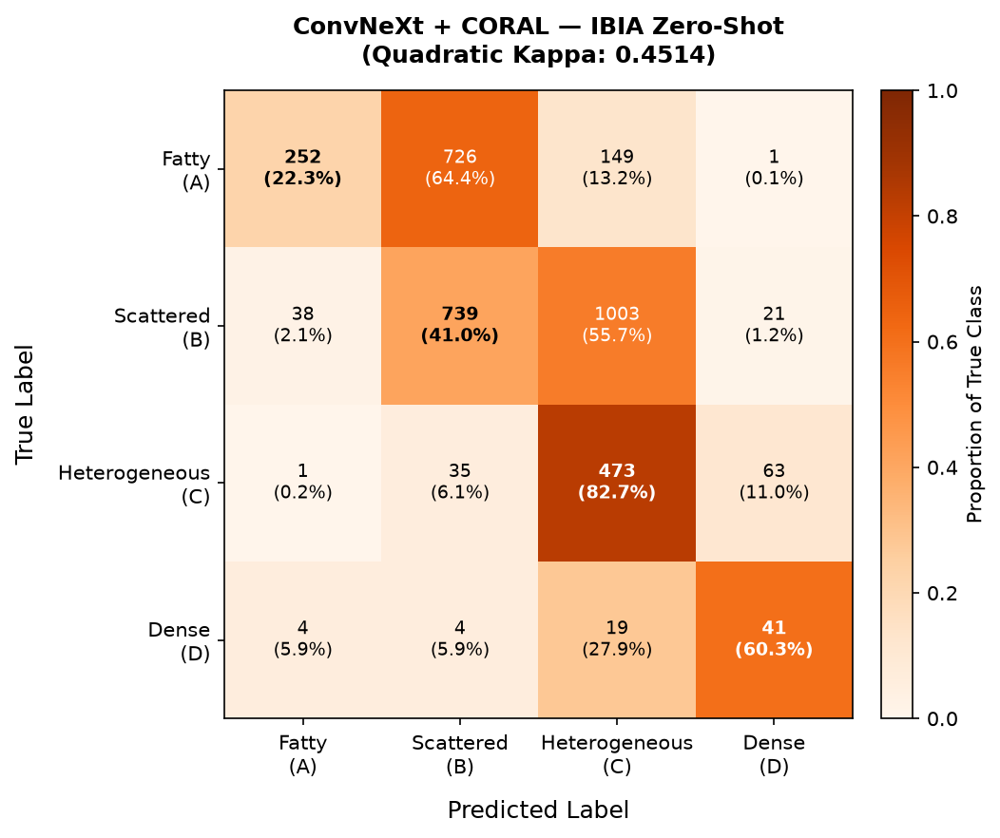

# Mammography Breast Density Classification: Experimental Consolidation

## 1. Project Overview & Motive
This project addresses the challenge of **Breast Density Classification** (BI-RADS Categories A, B, C, D) and specifically investigates the **Domain Shift** encountered when models trained on US populations (**EMBED**) are deployed on Indian populations (**IBIA**).

### Motive
Breast density is a critical risk factor for breast cancer and can mask tumors on mammograms. While high-performance models exist, generalization across different ethnic and anatomical populations is often poor. The objectives include:
1. Establishment of a robust baseline using traditional machine learning (LightGBM) and deep ordinal regression.
2. Quantification of the domain shift between the EMBED (Source) and IBIA (Target) datasets.
3. Development and evaluation of mitigation strategies including Zero-shot inference, Head recalibration, and Fine-tuning.
4. Investigation of modern backbone architectures (ConvNeXt) and their cross-population transferability under ordinal regression frameworks.

---

## 2. Experimental Setup

| Component | Details |
| :--- | :--- |
| **GPU** | NVIDIA GB10 |
| **CUDA Version** | 13.0 (Driver: 580.95.05) |
| **CPU** | Cortex-X925 (10 cores) + Cortex-A725 (10 cores) |
| **RAM** | 119 GiB total, ~109 GiB available |
| **Python** | 3.12.3 |
| **PyTorch** | 2.12.0+cu130 |
| **Framework** | PyTorch + torchvision |
| **Mixed Precision** | torch.cuda.amp (GradScaler + autocast) |

---

## 3. Dataset Description

### Sample Mammograms

#### EMBED Dataset (Source — US Population)

| Fatty (A) | Scattered (B) | Heterogeneous (C) | Dense (D) |
| :---: | :---: | :---: | :---: |
|  |  |  |  |
| *BI-RADS A: Almost entirely fatty* | *BI-RADS B: Scattered fibroglandular* | *BI-RADS C: Heterogeneously dense* | *BI-RADS D: Extremely dense* |

#### IBIA Dataset (Target — Indian Population)

| Fatty (A) | Scattered (B) | Heterogeneous (C) | Dense (D) |
| :---: | :---: | :---: | :---: |
|  |  |  |  |
| *BI-RADS A: Almost entirely fatty* | *BI-RADS B: Scattered fibroglandular* | *BI-RADS C: Heterogeneously dense* | *BI-RADS D: Extremely dense* |

### Dataset Statistics

### EMBED (Source — US Population)
- **Scale:** 37,563 mammograms from 9,398 patients.
- **Stratification:** Patient-stratified split (80% Train, 10% Validation, 10% Test) to prevent data leakage.
- **Labels:** ACR BI-RADS 5th Edition breast density categories (A–D) [1].
- **Modality:** Full-Field Digital Mammography (FFDM).
- **Cohort:** Diverse US population.
- **Key Characteristics:**
    - ~49% of studies represent dense breasts (Categories C and D).
    - 99.8% of patients possess complete 4-view mammograms (L/R CC and MLO).

### IBIA (Target — Indian Population)
- **Scale:** 3,569 images from 583 patients.
- **Labels:** ACR BI-RADS 5th Edition (A–D) [1].
- **Modality:** Full-Field Digital Mammography (FFDM).
- **Cohort:** Indian clinical population.
- **Demographics:** Patient age range [23, 87], average age 50.0.
- **Key Characteristics:**
    - Significant anatomical distribution shift: ~82.1% are Non-Dense (A+B).
    - Average of ~6.1 images per patient.
    - Utilized for Zero-shot evaluation and small-split adaptation experiments.

---

## 4. Experimental Framework & Methodology

### Phase 1: Feature Extraction Baseline (LightGBM)
A baseline was established using fixed feature extractors (ResNet50 [2] and EfficientNet-B7 [3] pretrained on ImageNet [4]).
- **Methodology:** High-dimensional feature vectors (2048-d for ResNet, 2560-d for EffNet) were extracted from the global average pooling layer.
- **Classifier:** LightGBM gradient boosting machine, tuned for 4-class classification.
- **Limitation:** Treats density categories as independent classes, ignoring the ordinal relationship (A < B < C < D).

### Phase 2: Deep Ordinal Regression (End-to-End with ResNet50)
Five deep ordinal regression architectures were implemented using a ResNet50 backbone [2], partially unfrozen for domain-specific refinement.

1. **OR-NN (Ordinal Neural Network):** $K-1$ binary classifiers with independent weights predicting whether density exceeds each threshold [5].
2. **CORAL (Consistent Rank Logits):** Shared weights with unique, rank-consistent bias terms ensuring nested probability structure [6].
3. **CORN (Conditional Ordinal Regression):** Conditional probability framework where reaching rank $k$ is conditioned on passing all previous ranks [7].
4. **Continuous Regression:** Treats ordinal labels as continuous targets, optimizing a regression loss directly over the rank space.
5. **Frank & Hall Binary Decomposition:** Decomposes the $K$-class ordinal problem into $K-1$ binary classifiers following the Frank & Hall framework [5].

### Phase 3: Advanced Backbone Ordinal Regression (ConvNeXt-Tiny + CORAL)
The ResNet50 backbone was replaced with **ConvNeXt-Tiny** [8].
- **Architecture:** Incorporates inverted bottlenecks, larger kernel sizes ($7\times7$), and Layer Normalization — design principles inspired by Vision Transformers [9].
- **Objective:** Improve fine-grained parenchymal feature extraction for the CORAL ordinal head.

### Phase 4: Cross-Population Adaptation (ConvNeXt-Tiny + CORAL on IBIA)
The EMBED-trained ConvNeXt-Tiny + CORAL model was evaluated and adapted on IBIA using the same adaptation strategies as ResNet + CORAL, to assess whether architectural improvements translate to better cross-population transferability.

### Phase 5: ConvNeXt-Small + CORN and Analytic Prior Correction
Two further experiments were conducted:
- **ConvNeXt-Small + CORN:** The CORN conditional ordinal loss was applied with a **ConvNeXt-Small** backbone on EMBED, achieving the highest in-distribution Kappa (0.8067). Note that this experiment changes both the backbone (Tiny → Small) and the loss (CORAL → CORN) relative to Phase 3; a controlled ablation separating these two factors is ongoing.
- **Analytic Prior Correction (Zero-shot):** A training-free post-hoc correction was applied to the ConvNeXt-Tiny + CORAL zero-shot predictions on IBIA. Log-odds of the EMBED class prior are subtracted from the model's output logits to counteract the source-domain bias — requiring no IBIA labels whatsoever [13].

---

## 5. Key Results & Technical Inferences

### Inference 1: Systematic Over-prediction
Zero-shot evaluation on IBIA revealed systematic over-prediction — "A" frequently predicted as "B", "B" as "C" — attributed to the dense-skewed EMBED prior. This occurs in both backbones, confirming it is dataset-level rather than architecture-specific.

### Inference 2: Feature Space Domain Shift (t-SNE)
t-SNE projections of the ResNet50 feature space show EMBED and IBIA forming distinct, non-overlapping clusters.

  
   
  <i>t-SNE visualization: Feature shift across geographic cohorts.</i>

**Technical Conclusion:** The domain shift is a **fundamental feature shift** — anatomical features are encoded differently for the two populations, not merely a label distribution mismatch.

### Inference 3: Failure of Optical Mitigation (Histogram Equalization)
Histogram equalization degraded performance (Kappa 0.48 → 0.33).

**Technical Conclusion:** The domain shift is **semantic/anatomical**, not optical. Contrast enhancement amplified the features that trigger high-density predictions in the EMBED-trained model.

### Inference 4: Efficacy of Head-Only Recalibration
Freezing the backbone and retraining only the CORAL head on 20% IBIA data yielded Kappa gains of **+0.09** (ResNet) and **+0.17** (ConvNeXt).

**Technical Conclusion:** A large fraction of domain shift is attributable to miscalibrated decision thresholds rather than inadequate features, especially for ConvNeXt whose features are inherently more expressive.

### Inference 5: Representation Capacity of ConvNeXt-Tiny
ConvNeXt-Tiny achieves EMBED Kappa 0.8020 using only the simplest ordinal loss (CORAL), outperforming all ResNet variants including those with more complex losses.

**Technical Conclusion:** ConvNeXt's transformer-inspired design excels at capturing fine-grained diffuse parenchymal patterns, providing more discriminative density boundaries [8].

### Inference 6: ConvNeXt-Tiny Adaptation Superiority
Despite lower zero-shot Kappa (0.4514 vs 0.4844), ConvNeXt-Tiny + CORAL outperforms ResNet50 + CORAL under both adaptation strategies.

**Technical Conclusion:** ConvNeXt encodes richer, more transferable representations that are initially over-biased toward EMBED priors but adapt rapidly with minimal target-domain data. **Backbone capacity is the dominant factor for adapted cross-population performance.**

### Inference 7: Efficacy of Label-Free Prior Correction
Analytic prior correction — subtracting EMBED log-prior from output logits — lifts zero-shot Kappa from 0.4514 to 0.5405 (+0.089) without accessing any IBIA labels.

**Technical Conclusion:** A substantial portion of the zero-shot error is attributable to a miscalibrated source prior rather than inadequate features. Prior correction provides a meaningful, label-free baseline that narrows the gap to supervised recalibration, consistent with findings in [13] on the advantages of ordinal methods under domain shift.

### Inference 8: ConvNeXt-Small + CORN Achieves Best In-Distribution Performance
ConvNeXt-Small + CORN achieves Kappa 0.8067 and MAE 0.2156 on EMBED, the highest of any model tested. However, this experiment simultaneously upgrades both the backbone (ConvNeXt-Tiny → Small) and the loss (CORAL → CORN) relative to Phase 3. The individual contributions of backbone capacity vs. loss function cannot be disentangled from these results alone.

**Technical Conclusion:** The ConvNeXt-Small + CORN combination yields the strongest in-distribution performance. A controlled ablation (ConvNeXt-Small + CORAL) is required to isolate whether the gain is driven by the larger backbone, the CORN loss, or both. This ablation is currently in progress.

---

## 6. Performance on EMBED (Training Domain)

| Method | Backbone | Accuracy | Quadratic Kappa | MAE |
| :--- | :---: | :---: | :---: | :---: |
| **ResNet50 + LGBM (Baseline)** [2] | ResNet50 | 0.6941 | ~0.72 | 0.35 |
| **ResNet50 + Continuous Regression** | ResNet50 | 0.7681 | 0.7918 | — |
| **ResNet50 + Frank & Hall Binary** [5] | ResNet50 | 0.7775 | 0.7946 | — |
| **ResNet50 + CORAL** [6] | ResNet50 | 0.7335 | 0.7833 | 0.2700 |
| **ResNet50 + CORN** [7] | ResNet50 | **0.7740** | 0.7884 | **0.2279** |
| **ResNet50 + OR-NN** [5] | ResNet50 | 0.7508 | 0.8008 | 0.2508 |
| **ConvNeXt-Tiny + CORAL** [6, 8] | ConvNeXt-Tiny | 0.7663 | 0.8020 | 0.2361 |
| **ConvNeXt-Small + CORN** † [7, 8] | ConvNeXt-Small | 0.7873 | **0.8067** | **0.2156** |

† Backbone and loss both differ from ConvNeXt-Tiny + CORAL; individual contributions are not yet disentangled. Ablation (ConvNeXt-Small + CORAL) in progress.

*ConvNeXt-Small + CORN achieves the highest Quadratic Kappa (0.8067) and lowest MAE (0.2156). ConvNeXt-Tiny + CORAL already surpasses all ResNet variants using the simplest ordinal loss, demonstrating that backbone capacity drives meaningful gains.*

---

## 7. Performance Matrix (Evaluation on IBIA)

### ResNet50 + CORAL (EMBED → IBIA)

| Strategy | Quadratic Kappa | Technical Result Summary |
| :--- | :---: | :--- |
| **Zero-shot** | 0.4844 | High bias due to learned EMBED priors. |
| **Histogram Equalization** | 0.3296 | Ineffective; amplified distribution shift. |
| **Head-Only Recalibration** | 0.5746 | Efficient adaptation via threshold shifting. |
| **Differential Fine-tuning** | 0.5971 | Optimal (Backbone 1e-5, Head 1e-3). |

### ConvNeXt-Tiny + CORAL (EMBED → IBIA)

| Strategy | Quadratic Kappa | Accuracy | MAE | vs. ResNet CORAL | Uses IBIA Labels? |
| :--- | :---: | :---: | :---: | :---: | :---: |
| **Zero-shot** | 0.4514 | 0.4217 | 0.6301 | -0.033 | No |
| **Prior Correction (Zero-shot)** [13] | 0.5405 | 0.5797 | 0.4393 | +0.056 | No |
| **Head-Only Recalibration** | 0.6258 | 0.6579 | 0.3553 | +0.051 | Yes (20%) |
| **Differential Fine-tuning** | **0.6535** | **0.6723** | **0.3417** | **+0.056** | Yes (20%) |

*Prior correction yields a Kappa gain of +0.089 over zero-shot with zero labeled target data. ConvNeXt-Tiny + CORAL differential fine-tuning achieves the best overall adapted cross-population result, surpassing ResNet's best by +0.056 Kappa.*

### ConvNeXt-Small + CORN (EMBED → IBIA)

| Strategy | Quadratic Kappa | Accuracy | MAE | vs. ConvNeXt-Tiny + CORAL | Uses IBIA Labels? |
| :--- | :---: | :---: | :---: | :---: | :---: |
| **Zero-shot** | 0.4427 | 0.4068 | 0.6442 | -0.009 | No |
| **Prior Correction** | — | — | — | — | No |
| **Head-Only Recalibration** | — | — | — | — | Yes (20%) |
| **Differential Fine-tuning** | — | — | — | — | Yes (20%) |

*IBIA adaptation experiments for ConvNeXt-Small + CORN are in progress. Zero-shot Kappa (0.4427) is marginally lower than ConvNeXt-Tiny + CORAL (0.4514), consistent with the pattern that a stronger in-distribution model is not necessarily better zero-shot. Note: Fatty recall is severely degraded (0.193) — only 218/1128 Fatty cases correctly classified, with 757 pushed to Scattered, indicating stronger over-prediction bias than CORAL zero-shot.*

---

## 8. Confusion Matrices
### ConvNeXt + CORAL — All Evaluation Conditions

  
   
  <i>Confusion matrices: ConvNeXt + CORAL across EMBED and three IBIA evaluation conditions.</i>

### Individual Matrices

  
   
  <i>ConvNeXt + CORAL on EMBED test set (Kappa: 0.8020).</i>

  
   
  <i>ConvNeXt + CORAL — IBIA Zero-Shot (Kappa: 0.4514).</i>

  
   
  <i>ConvNeXt + CORAL — IBIA Head Recalibration (Kappa: 0.6258).</i>

  
   
  <i>ConvNeXt + CORAL — IBIA Differential Fine-Tuning (Kappa: 0.6535).</i>

### ResNet + CORAL — Best Adapted (IBIA Head Recalibration)

  
   
  <i>Recalibrated ResNet + CORAL on IBIA (Kappa: 0.5746).</i>

---

## 9. ConvNeXt Per-Class Analysis (EMBED)

### ConvNeXt-Tiny + CORAL

| BI-RADS Category | Precision | Recall | F1-Score | Support |
| :--- | :---: | :---: | :---: | :---: |
| **Fatty (A)** | 0.59 | 0.75 | 0.66 | 388 |
| **Scattered (B)** | 0.77 | 0.75 | 0.76 | 1525 |
| **Heterogeneous (C)** | 0.85 | 0.79 | 0.82 | 1623 |
| **Dense (D)** | 0.62 | 0.77 | 0.69 | 216 |

Key observations:
- Only **9/3,752 cases (0.24%)** misclassified by more than one ordinal rank — confirming CORAL's structural constraint.
- Recall is balanced across all classes (0.75–0.79), showing no class-imbalance bias.
- Lower precision on extreme categories (Fatty: 0.59, Dense: 0.62) reflects inherent boundary ambiguity between adjacent BI-RADS categories [1].

### ConvNeXt-Small + CORN

| BI-RADS Category | Precision | Recall | F1-Score | Support |
| :--- | :---: | :---: | :---: | :---: |
| **Fatty (A)** | 0.68 | 0.69 | 0.68 | 388 |
| **Scattered (B)** | 0.78 | 0.77 | 0.78 | 1525 |
| **Heterogeneous (C)** | 0.83 | 0.84 | 0.83 | 1623 |
| **Dense (D)** | 0.71 | 0.73 | 0.72 | 216 |

Key observations:
- Per-class metrics improve across all categories relative to ConvNeXt-Tiny + CORAL, particularly at the extremes (Fatty precision: 0.68 vs 0.59, Dense precision: 0.71 vs 0.62).
- Macro F1 improves from 0.736 (ConvNeXt-Tiny + CORAL) to 0.752 (ConvNeXt-Small + CORN).
- These gains reflect the combined effect of a larger backbone (Small vs Tiny) and the CORN loss; they cannot be attributed to either factor independently without a controlled ablation.

---

## 10. Summary of Findings

| Finding | Result |
| :--- | :--- |
| Best in-distribution (EMBED) | ConvNeXt-Small + CORN, Kappa **0.8067**, MAE **0.2156** † |
| Best zero-shot cross-population (IBIA) | ResNet50 + CORAL, Kappa **0.4844** |
| Best label-free cross-population (IBIA) | ConvNeXt-Tiny + CORAL + Prior Correction, Kappa **0.5405** (+0.089 over zero-shot) |
| Best adapted cross-population (IBIA) | ConvNeXt-Tiny + CORAL + Diff. FT, Kappa **0.6535** |
| Most efficient adaptation | ConvNeXt-Tiny + CORAL head recalibration (+0.174 Kappa, <1% params updated) |

† Backbone (Tiny→Small) and loss (CORAL→CORN) co-vary; ablation in progress.

---

## 11. Folder Structure

- `baseline_LGBM/` — Baseline LightGBM experiments with fixed feature extraction.
- `ConvNeXt_CORAL/` — Training and evaluation scripts for ConvNeXt + CORAL.
  - `train_convnext.py` — Training script.
  - `test_convnext.py` — Evaluation script.
  - `results.txt` — Metrics and confusion matrix.
- `ConvNeXt_CORN/` — Training and evaluation scripts for ConvNeXt + CORN.
  - `convnext_corn_best_metrics.json` — Best checkpoint metrics.
- `Ordinal_Regression/`
  - `BEST_MODELS/` — Serialized weights for CORAL, CORN, OR-NN, ConvNeXt + CORAL, and ConvNeXt + CORN.
  - `EXPERIMENTS/` — Training logs and hyperparameter details.
  - `RESULTS/` — Metrics, confusion matrices, t-SNE visualizations, and prior correction results.
- `sample_images/` — Representative PNG samples from EMBED and IBIA cohorts.
- `mammography-datasets/analysis/` — All training, evaluation, adaptation, and prior correction scripts.

---

## 12. References

[1] D'Orsi et al. (2013). *ACR BI-RADS Atlas, Breast Imaging Reporting and Data System.* American College of Radiology.

[2] He et al. (2016). *Deep Residual Learning for Image Recognition.* CVPR.

[3] Tan and Le (2019). *EfficientNet: Rethinking Model Scaling for Convolutional Neural Networks.* ICML.

[4] Deng et al. (2009). *ImageNet: A Large-Scale Hierarchical Image Database.* CVPR.

[5] Frank and Hall (2001). *A Simple Approach to Ordinal Classification.* ECML. *(OR-NN / Frank & Hall binary decomposition)*

[6] Cao et al. (2020). *Rank Consistent Ordinal Regression for Neural Networks with Application to Age Estimation.* Pattern Recognition Letters. *(CORAL)*

[7] Shi et al. (2023). *Deep Neural Networks for Rank-Consistent Ordinal Regression Based on Conditional Probabilities.* TPAMI. *(CORN)*

[8] Molina-Roman et al. (2025). *Comparison of ConvNeXt and Vision-Language Models for Breast Density Assessment in Screening Mammography.*

[9] Liu et al. (2022). *A ConvNet for the 2020s.* CVPR.

[10] Lin et al. (2017). *Focal Loss for Dense Object Detection.* ICCV.

[11] Zha et al. (2023). *Rank-N-Contrast: Learning Continuous Representations for Regression.* NeurIPS.

[12] Squires et al. (2024). *Model Uncertainty Estimates for Deep Learning Mammographic Density Prediction Using Ordinal and Classification Approaches.*

[13] Perrett, Brown, and Bosilj. *The Benefits of Ordinal Regression Under Domain Shift.* University of Lincoln.